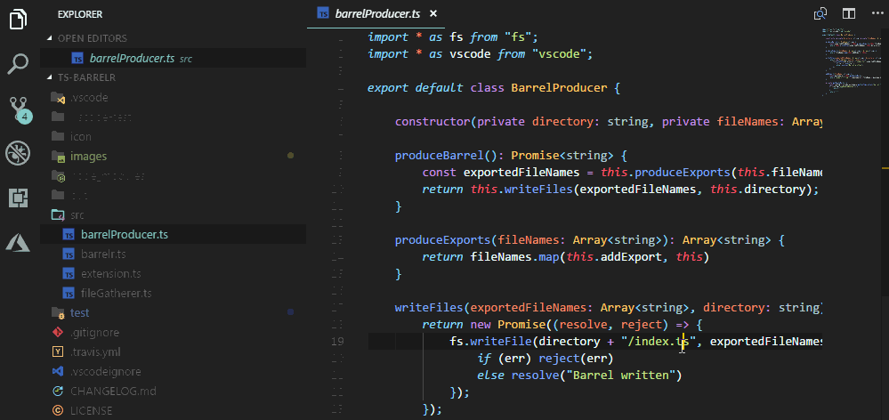
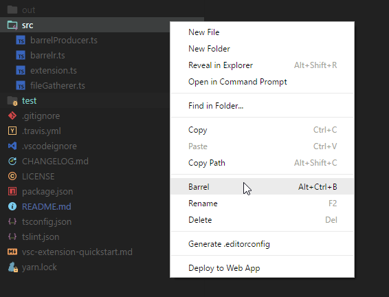

# ts-barrelr
[](https://marketplace.visualstudio.com/items?itemName=mikerhyssmith.ts-barrelr)
[](https://marketplace.visualstudio.com/items?itemName=mikerhyssmith.ts-barrelr)
[](https://travis-ci.org/mikerhyssmith/ts-barrelr)


## Features

ts-barrelr automates the production of index.ts barrel files.

ts-barrelr will produce an index.ts containing all files and folders within the folder containing the current file open in the editor window.

There are two ways to trigger barrelr:

- Select the barrel action from the actions menu or use the keybinds  ```ctrl-alt-b``` / ```cmd-alt-b``` with a file open to create an `index.ts` in the folder of the currently open file:



- Right click on a folder and select 'Barrel' to create an index.ts file for that folder.
    


Running the command again will update the barrel with any new or changed files.


## Configuration

### Included files:
By default barrelr will include any files with a `.ts` or `.tsx` extension but this can be configured via the setting **barrelr.fileExtensionRegex**

### Quote Marks:
By default ts-barrelr will use single quotes as the default quotemark for imports in index.ts files. This can be changed to double quotes using the setting: **barrelr.useDoubleQuotes**

### Files to exclude:
By default ts-barrelr will exclude any files containing .spec., .e2e. or .test. This can be changed as a regular expression by changing the setting:  **barrelr.excludeFileRegex**
